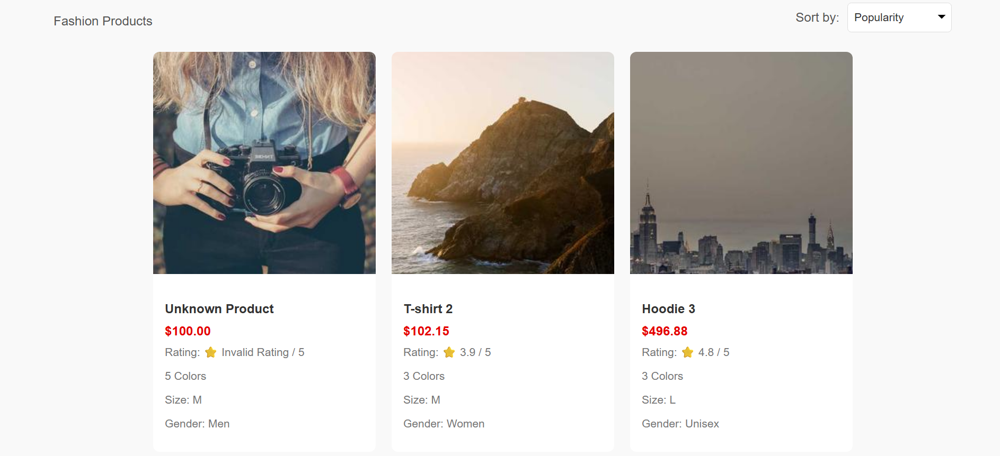
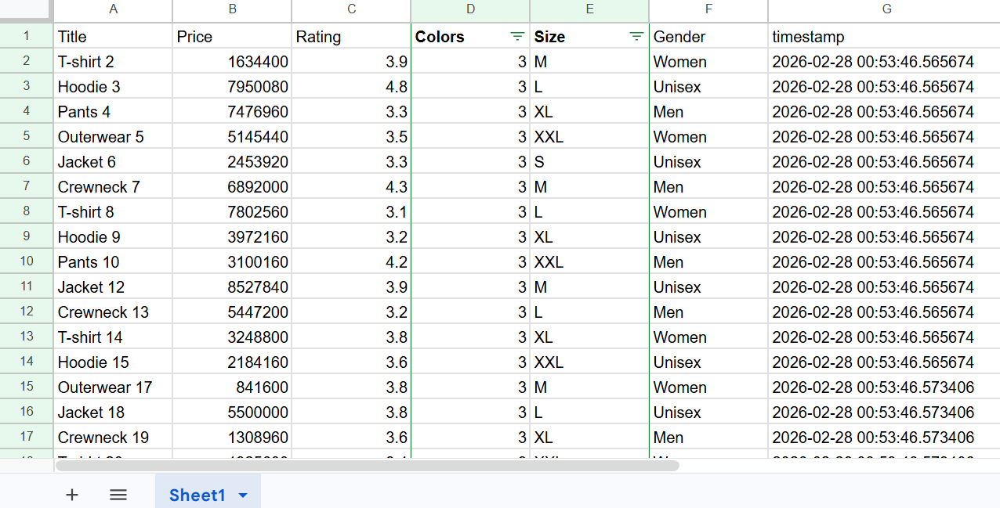
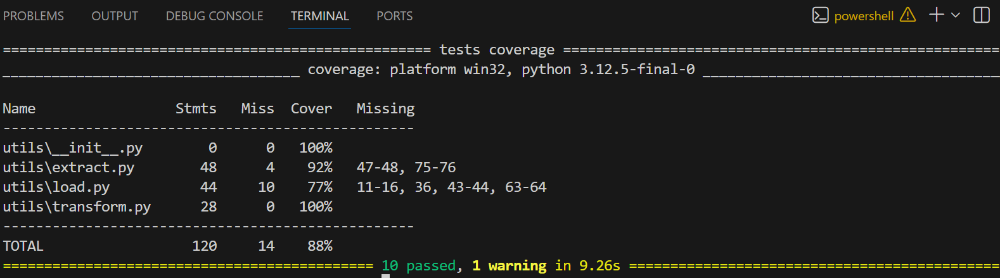

# ETL Fashion Studio Pipeline Project

I recently completed a web scraping and ETL pipeline project for Fashion Studio product data.

Author:
Nadine Putri Larasati

LinkedIn:
https://www.linkedin.com/in/nadine-putri-larasati-847214395/

## What I Did:

- Built an Extract, Transform, Load (ETL) pipeline using Python
- Extracted product data from the Fashion Studio website using web scraping
- Cleaned and transformed the collected data using pandas
- Loaded the processed data into CSV files and Google Sheets
- Implemented unit testing with pytest and achieved 88% test coverage

## Tools:

Python, Git, GitHub, beautifulsoup4, coverage, gspread, numpy, oauth2client, pandas, psycopg2-binary, pytest, pytest-cov, requests, and SQLAlchemy.

## URL google sheets:

https://docs.google.com/spreadsheets/d/16TjWQkdeJPt65VbtPS8YZw-VrDxuPztFCFE5CnAdxOU/edit?gid=0#gid=0

## Preview





## AI Attribution/Acknowledgements

Concept: I utilized ChatGPT to understand the concepts within the context of an ETL pipeline.

Syntax and Debugging: I utilized ChatGPT to refine and debug my code, applying adjustments provided by the model to ensure alignment with Python syntax.

Note: All code has been personally tested and modified.

## Directory Structure

```
├── tests
    └── test_extract.py
    └── test_transform.py
    └── test_load.py
├── utils
    └── extract.py
    └── transform.py
    └── load.py
├── main.py
├── requirements.txt
├── submission.txt
├── products.csv
├── .gitignore
```

## Run ETL pipeline

### install dependencies
```
pip install -r requirements.txt
```

### Run script ETL
```
python main.py
```

## Run unit test
```
python -m pytest tests
```

## Run test coverage
```
python -m pytest --cov=utils --cov-report=term-missing
```
